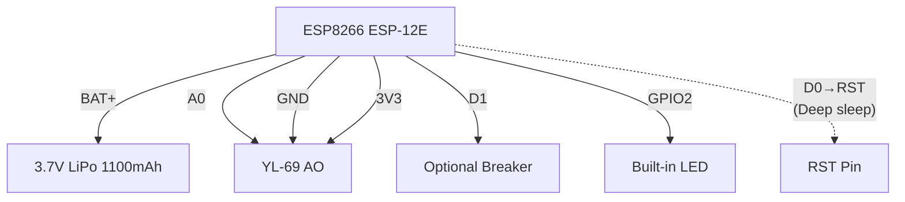

# 🌱 ESP8266 Humidity Monitor with WhatsApp Alerts

ESP8266 (ESP-12E) + YL-69 soil moisture sensor that measures humidity every hour, sends to WhatsApp via CallMeBot, and enters **deep sleep** for maximum battery life.

## 📋 Features

- ✅ **YL-69 analog measurement** (calibrated: dry=1023, wet=423)
- ✅ **Automatic WhatsApp** via CallMeBot API  
- ✅ **1 hour deep sleep** (~20µA, battery lasts months)
- ✅ **Robust WiFi** with BSSID selection and auto-reconnect
- ✅ **LED indicator** on during operation
- ✅ **NTP synchronization** for accurate timestamps
- ✅ **3 WhatsApp retry attempts** per cycle

## 🛠️ Hardware

**Deep sleep optional:** `D0(GPIO16) → RST` (remove for programming)

## 🔧 Sensor Calibration

```cpp
const int ADC_DRY = 1023;  // Dry
const int ADC_WET = 423;   // Wet
// 0% = dry, 100% = wet
```

## 📱 Sample WhatsApp Message
```text
💧 Soil moisture measurement
⏰ 07/02/2026 18:36:42
📊 Raw value: 856
📈 Estimated: 27%
```

## 📄 License
MIT License - Free to use, give credit.

Written by [@snackk](https://github.com/snackk)
